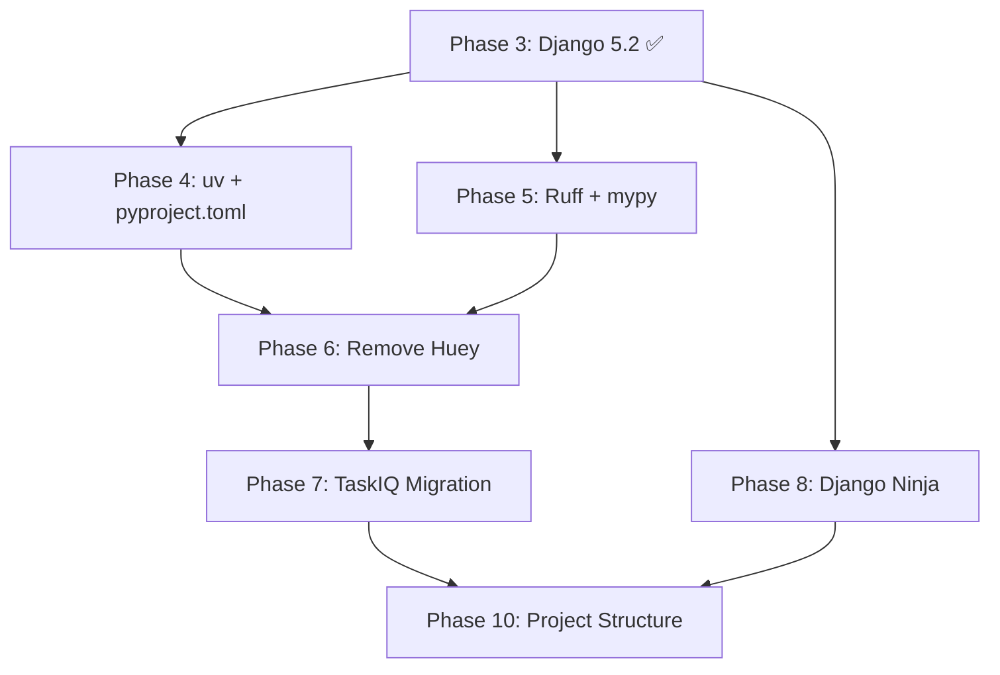

# Modernization Roadmap

Current status and future migration path for Boundlexx (2025).

## 📊 Current Status: Phase 3 Complete

**✅ Completed Phases:**
- **Phase 1 & 2**: Python 3.12 + Database Compatibility
- **Phase 3**: Django 5.2 LTS Core Upgrade + Container Modernization

**📍 Current Foundation:**
- Python 3.12.11 (LTS)
- Django 5.2.6 (LTS until April 2028)
- Modern container naming (`boundlexx-*-dev`, `boundlexx-*-test`)
- Steam authentication (21-day sessions, production ready)

**📚 Historical Context:**
Original planning targeted Django 5.1, but the project exceeded goals by achieving Django 5.2.6 LTS. For detailed planning history, see [Archived Plans](../../modernization/archived_plans/).

## 🗺️ Future Migration Path (Phases 4-10)

### Phase 4: uv + pyproject.toml Migration
**Status**: 📋 Planned
**Timeline**: Q4 2025
**Goals**: Modern Python dependency management

**Benefits:**
- Faster dependency resolution
- Better lock file management
- Improved reproducibility
- Modern Python standards

**Migration Steps:**
1. Install uv package manager
2. Convert requirements/*.in → pyproject.toml
3. Update CI/CD pipelines
4. Test dependency resolution
5. Update documentation

### Phase 5: Ruff + mypy Setup
**Status**: 📋 Planned
**Timeline**: Q1 2026
**Goals**: Modern linting and type checking

**Benefits:**
- Faster linting (10-100x speedup)
- Better type safety with mypy
- Consistent code style
- Enhanced IDE integration

**Migration Steps:**
1. Configure Ruff to replace Black, Flake8, isort
2. Set up mypy type checking
3. Fix existing type issues
4. Update pre-commit hooks
5. Update CI/CD validation

### Phase 6: Remove Huey → Celery Consolidation
**Status**: 📋 Planned
**Timeline**: Q1 2026
**Goals**: Single background task system

**Benefits:**
- Simplified architecture
- Better monitoring tools
- Consistent task management
- Reduced complexity

**Migration Steps:**
1. Audit Huey tasks vs Celery tasks
2. Migrate Huey tasks to Celery
3. Update configuration
4. Test background processing
5. Remove Huey dependencies

### Phase 7: TaskIQ Parallel Setup + Gradual Migration
**Status**: 📋 Planned
**Timeline**: Q2 2026
**Goals**: Modern async task processing

**Benefits:**
- Async/await support
- Better performance
- Modern Python patterns
- Django 5.2 async compatibility

**Migration Steps:**
1. Set up TaskIQ alongside Celery
2. Migrate critical tasks to TaskIQ
3. Performance testing and comparison
4. Gradual migration of remaining tasks
5. Remove Celery when migration complete

### Phase 8: Django Ninja v3 API Migration
**Status**: 📋 Planned
**Timeline**: Q3 2026
**Goals**: Fast, type-safe APIs

**Benefits:**
- 3-5x performance improvement
- Automatic OpenAPI generation
- Type safety with Pydantic
- Modern async support

**Migration Steps:**
1. Set up Django Ninja alongside DRF
2. Migrate v2 API endpoints
3. Implement new v3 API with Ninja
4. Performance testing
5. Deprecate DRF endpoints

### Phase 9: Steam Authentication (Complete ✅)
**Status**: ✅ Complete
**Implemented**: September 2025

**Achievements:**
- 21-day encrypted app tickets
- 95% reduction in 2FA prompts
- Multi-account round-robin distribution
- Production-ready rate limiting

### Phase 10: Project Structure Modernization
**Status**: 📋 Planned
**Timeline**: Q4 2026
**Goals**: Modern project organization

**Benefits:**
- Clear separation of concerns
- Better testability
- Easier maintenance
- Industry standard structure

**Migration Steps:**
1. Analyze ark-operator patterns
2. Design new structure
3. Gradual refactoring
4. Update imports and references
5. Update documentation

## 🔄 Migration Strategy

### Forward Compatibility Policy

**All current development must consider:**
- Django 5.2 LTS compatibility
- TaskIQ async readiness
- Django Ninja API compatibility
- uv dependency management
- Ruff + mypy standards

### Risk Mitigation

1. **Incremental Migration**: Each phase builds on previous
2. **Parallel Systems**: Run old and new systems side-by-side
3. **Comprehensive Testing**: Validate each phase thoroughly
4. **Rollback Plans**: Document rollback for each phase
5. **Performance Monitoring**: Track performance throughout

### Dependencies Between Phases

## 📈 Success Metrics

### Phase Completion Criteria

Each phase must meet:
- ✅ All tests passing
- ✅ Performance maintained or improved
- ✅ Documentation updated
- ✅ Team training completed
- ✅ Rollback plan validated

### Overall Goals (End of 2026)

- **Performance**: 50% improvement in API response times
- **Maintainability**: 75% reduction in dependency conflicts
- **Developer Experience**: 90% reduction in setup time
- **Type Safety**: 95% type coverage with mypy
- **Modernization**: 100% modern Python standards compliance

## 🛠️ Implementation Guidelines

### Development Standards

1. **All new features** must be compatible with target stack
2. **Database changes** must consider TaskIQ async patterns
3. **API endpoints** should prepare for Django Ninja migration
4. **Code style** should follow Ruff standards
5. **Dependencies** should be compatible with uv

### Testing Requirements

1. **Container-first development** to avoid environment conflicts
2. **Comprehensive test coverage** for each migration phase
3. **Performance benchmarking** before and after changes
4. **Integration testing** across all modified components

## 🆘 Rollback Procedures

### Emergency Rollback

Each phase includes:
1. **Tagged releases** before and after migration
2. **Database backup/restore** procedures
3. **Configuration rollback** scripts
4. **Dependency downgrade** procedures
5. **Service restart** procedures

### Partial Rollback

Ability to rollback individual components:
- API endpoints (DRF ↔ Django Ninja)
- Task systems (Celery ↔ TaskIQ)
- Dependency management (pip ↔ uv)
- Linting systems (legacy ↔ Ruff)

## 🔗 Related Documentation

- [Django 5.2 Upgrade Guide](django-upgrade.md)
- [Breaking Changes](breaking-changes.md)
- [Development Workflows](../workflows/development.md)
- [Architecture Overview](../architecture/overview.md)

---

*This roadmap is updated quarterly. Last updated: September 2025*
